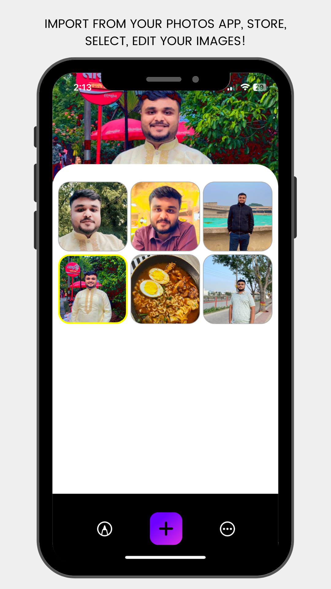

<!-- Copyright 2023 Md. Mahinur Rahman-->
<!---->
<!-- Licensed under the Apache License, Version 2.0 (the "License");-->
<!-- you may not use this file except in compliance with the License.-->
<!-- You may obtain a copy of the License at-->
<!---->
<!--     http://www.apache.org/licenses/LICENSE-2.0-->
<!---->
<!-- Unless required by applicable law or agreed to in writing, software-->
<!-- distributed under the License is distributed on an "AS IS" BASIS,-->
<!-- WITHOUT WARRANTIES OR CONDITIONS OF ANY KIND, either express or implied.-->
<!-- See the License for the specific language governing permissions and-->
<!-- limitations under the License.-->

<h1>PhotoPage</h1>
  PhotoPage is an iOS app built with UIKit. Here user can store, Edit images from the Photos app.

<h3>Demo</h3>

https://github.com/MahinMuhammad/PhotoCollection/assets/83515380/eb4a8f26-484c-43a6-8624-5ed5e8165312

<h3>Graphical User Interface</h3>
  <table style="border:none">
    <tr>
        <td></td>
        <td></td>
     </tr>
  </table>

  <h3>Technologies used</h3>
  <ul>
    <li>UiKit</li>
    <li>CoreImage</li>
    <li>Coredata</li>
    <li>MVC</li>
    <li>Swift</li>
    <li>XCode</li>
  </ul>
  
  <h3>Requirements</h3>
    <ol>
        <li>iOS 14.0 or later</li>
        <li>Xcode 12.0 or later</li>
        <li>Swift 5.3 or later</li>
    </ol>

<h3>Getting Started</h3>
  To clone this app and run it on Xcode, follow these steps:

<ol>
    <li>Clone the repository: git clone https://github.com/MahinMuhammad/PhotoCollection</li>
    <li>Open the PhotoCollection.xcodeproj file in Xcode.</li>
    <li>Go to "Signin & Capabilities" and change the bundle identifier as your own</li>
    <li>Build and run the project in Xcode.</li>
</ol> 
  
<h3>Features</h3>
<ol>
  <li>Store images from Photos app</li>
  <li>Apply filters to image</li>
  <li>Save Edited images</li>
  <li>Delete one or all images from app</li>
  <li>Save images to Photos app</li>
  <li>Drqag and drop to change image index in CollectionView</li>
</ol>  

<h3>Upcomming Features</h3>
<ol>
  <li>Change intensity of filters</li>
  <li>Share image to socail platforms</li>
  <li>Crop image</li>
  <li>Shaprenning image</li>
  <li>Make collage of images</li>
</ol>  
    
### Find Me on:
[FaceBook](https://web.facebook.com/mahin5muhammad)
[Instagram](https://www.instagram.com/mahin5muhammad/)
[LinkedIn](https://www.linkedin.com/in/rahmanmahin/)
[Twitter](https://twitter.com/ImMahin)
[Website](https://mahinmuhammad.github.io/view/home.html)
[Discord](http://discordapp.com/users/Ghost_Friday#2625)

### Contributing
Contributions to Al Quran Stream are welcome! If you encounter any issues or have ideas for improvements, 
please feel free to open an issue or submit a pull request.

### Feedback
Please feel free to open any [issue](https://github.com/MahinMuhammad/PhotoCollection/issues)
  
<h3>License</h3>
  This project is licensed under the Apache License 2.0 - see the LICENSE file for details.

### Author
Md. Mahinur Rahman, iOS Developer  
rahmanmahin@icloud.com

<table style="border:none">
  <tr>  
    <td align="center"></h4></td>
  </tr>
  <tr>  
    <td align="center"><h4>Developed by   Md. Mahinur Rahman</h4></td>
  </tr>
</table>
