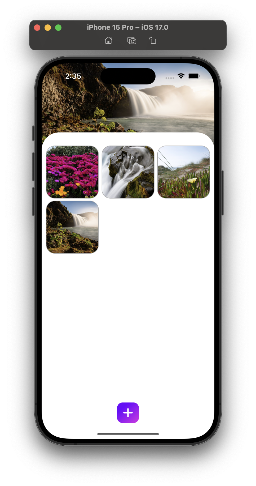
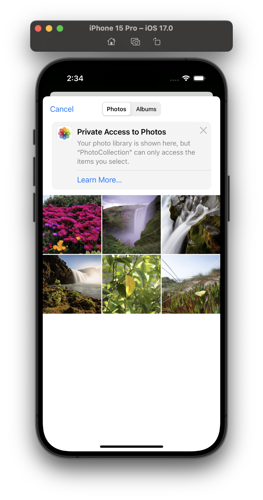
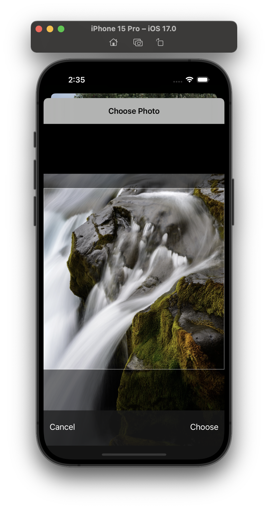

<!-- Copyright 2023 Md. Mahinur Rahman-->
<!---->
<!-- Licensed under the Apache License, Version 2.0 (the "License");-->
<!-- you may not use this file except in compliance with the License.-->
<!-- You may obtain a copy of the License at-->
<!---->
<!--     http://www.apache.org/licenses/LICENSE-2.0-->
<!---->
<!-- Unless required by applicable law or agreed to in writing, software-->
<!-- distributed under the License is distributed on an "AS IS" BASIS,-->
<!-- WITHOUT WARRANTIES OR CONDITIONS OF ANY KIND, either express or implied.-->
<!-- See the License for the specific language governing permissions and-->
<!-- limitations under the License.-->

<h1>PhotoCollection</h1>
  PhotoCollection is an iOS app built with UIKit. Here user can store images from the Photos app.

<h3>Demo</h3>

https://github.com/MahinMuhammad/PhotoCollection/assets/83515380/9d96a050-f68b-483f-b1f3-6e270eadcd15

<h3>Graphical User Interface</h3>
  <table style="border:none">
    <tr>
        <td></td>
        <td></td>
        <td></td>
     </tr>
  </table>

  <h3>Technologies used</h3>
  <ul>
    <li>UiKit</li>
    <li>Swift</li>
    <li>Coredata</li>
    <li>CollectionView</li>
    <li>PickerControllerDelegate</li>
  </ul>
  
  <h3>Requirements</h3>
    <ol>
        <li>iOS 13.0 or later</li>
        <li>Xcode 12.0 or later</li>
        <li>Swift 5.3 or later</li>
    </ol>

<h3>Getting Started</h3>
  To clone this app and run it on Xcode, follow these steps:

<ol>
    <li>Clone the repository: git clone https://github.com/MahinMuhammad/PhotoCollection</li>
    <li>Open the PhotoCollection.xcodeproj file in Xcode.</li>
    <li>Go to "Signin & Capabilities" and change the bundle identifier as your own</li>
    <li>Build and run the project in Xcode.</li>
</ol> 
  
<h3>Features</h3>

<ol>
  <li>Store images from Photos app.</li>
  <li>Displays images in a collection view.</li>
  <li>Drqag and drop to change image index in CollectionView</li>
</ol>  
    
<h3>Contributing</h3>
  I welcome contributions from the community! To contribute to PhotoCollection, follow these steps:

<ol>
    <li>Fork the repository.</li>
    <li>Create a new branch for your feature: git checkout -b feature/your-feature-name.</li>
    <li>Make your changes and commit them: git commit -m "Add your commit message here".</li>
    <li>Push your changes to your forked repository: git push origin feature/your-feature-name.</li>
    <li>Submit a pull request to the main repository.</li>
</ol>
  
<h3>License</h3>
  This project is licensed under the Apache License 2.0 - see the LICENSE file for details.

<h3>Contact</h3>
  If you have any questions or comments about ChatGenie, feel free to reach out to me at rahmanmahin@icloud.com.

<table style="border:none">
  <tr>  
    <td align="center"></h4></td>
  </tr>
  <tr>  
    <td align="center"><h4>Developed by   Md. Mahinur Rahman</h4></td>
  </tr>
</table>
